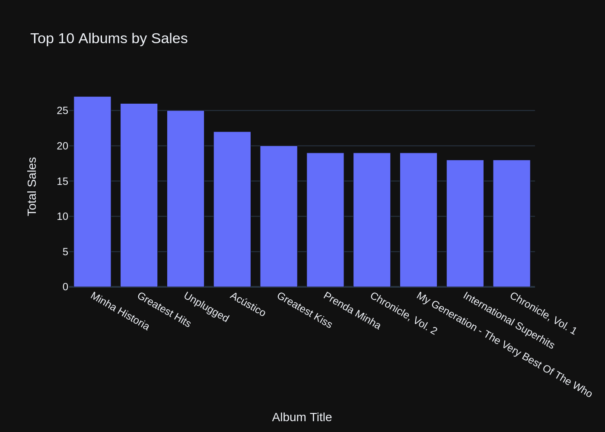

# vanna example:

## 依赖项安装:

```bash
pip install vanna
```

## 运行:

```python
import vanna
from vanna.remote import VannaDefault
# vn = VannaDefault(model='chinook', api_key=vanna.get_api_key('my-email@example.com'))
vn = VannaDefault(model='chinook', api_key=vanna.get_api_key('peilongchencc@163.com'))  # 会提示输入发送到邮箱的验证码
vn.connect_to_sqlite('https://vanna.ai/Chinook.sqlite')
vn.ask("What are the top 10 albums by sales?")
```

终端显示的log信息如下:<br>

```log
Check your email for the code and enter it here: D9TVI7
[{'role': 'system', 'content': "You are a SQLite expert. \n===Tables \nCREATE TABLE [Album]\n(\n    [AlbumId] INTEGER  NOT NULL,\n    [Title] NVARCHAR(160)  NOT NULL,\n    [ArtistId] INTEGER  NOT NULL,\n    CONSTRAINT [PK_Album] PRIMARY KEY  ([AlbumId]),\n    FOREIGN KEY ([ArtistId]) REFERENCES [Artist] ([ArtistId]) \n\t\tON DELETE NO ACTION ON UPDATE NO ACTION\n)\n\nCREATE INDEX [IFK_AlbumArtistId] ON [Album] ([ArtistId])\n\nCREATE INDEX [IFK_TrackAlbumId] ON [Track] ([AlbumId])\n\nCREATE TABLE [Track]\n(\n    [TrackId] INTEGER  NOT NULL,\n    [Name] NVARCHAR(200)  NOT NULL,\n    [AlbumId] INTEGER,\n    [MediaTypeId] INTEGER  NOT NULL,\n    [GenreId] INTEGER,\n    [Composer] NVARCHAR(220),\n    [Milliseconds] INTEGER  NOT NULL,\n    [Bytes] INTEGER,\n    [UnitPrice] NUMERIC(10,2)  NOT NULL,\n    CONSTRAINT [PK_Track] PRIMARY KEY  ([TrackId]),\n    FOREIGN KEY ([AlbumId]) REFERENCES [Album] ([AlbumId]) \n\t\tON DELETE NO ACTION ON UPDATE NO ACTION,\n    FOREIGN KEY ([GenreId]) REFERENCES [Genre] ([GenreId]) \n\t\tON DELETE NO ACTION ON UPDATE NO ACTION,\n    FOREIGN KEY ([MediaTypeId]) REFERENCES [MediaType] ([MediaTypeId]) \n\t\tON DELETE NO ACTION ON UPDATE NO ACTION\n)\n\nCREATE TABLE [Artist]\n(\n    [ArtistId] INTEGER  NOT NULL,\n    [Name] NVARCHAR(120),\n    CONSTRAINT [PK_Artist] PRIMARY KEY  ([ArtistId])\n)\n\nCREATE TABLE [Playlist]\n(\n    [PlaylistId] INTEGER  NOT NULL,\n    [Name] NVARCHAR(120),\n    CONSTRAINT [PK_Playlist] PRIMARY KEY  ([PlaylistId])\n)\n\nCREATE TABLE [Genre]\n(\n    [GenreId] INTEGER  NOT NULL,\n    [Name] NVARCHAR(120),\n    CONSTRAINT [PK_Genre] PRIMARY KEY  ([GenreId])\n)\n\nCREATE TABLE [InvoiceLine]\n(\n    [InvoiceLineId] INTEGER  NOT NULL,\n    [InvoiceId] INTEGER  NOT NULL,\n    [TrackId] INTEGER  NOT NULL,\n    [UnitPrice] NUMERIC(10,2)  NOT NULL,\n    [Quantity] INTEGER  NOT NULL,\n    CONSTRAINT [PK_InvoiceLine] PRIMARY KEY  ([InvoiceLineId]),\n    FOREIGN KEY ([InvoiceId]) REFERENCES [Invoice] ([InvoiceId]) \n\t\tON DELETE NO ACTION ON UPDATE NO ACTION,\n    FOREIGN KEY ([TrackId]) REFERENCES [Track] ([TrackId]) \n\t\tON DELETE NO ACTION ON UPDATE NO ACTION\n)\n\nCREATE INDEX [IFK_TrackGenreId] ON [Track] ([GenreId])\n\nCREATE TABLE [Customer]\n(\n    [CustomerId] INTEGER  NOT NULL,\n    [FirstName] NVARCHAR(40)  NOT NULL,\n    [LastName] NVARCHAR(20)  NOT NULL,\n    [Company] NVARCHAR(80),\n    [Address] NVARCHAR(70),\n    [City] NVARCHAR(40),\n    [State] NVARCHAR(40),\n    [Country] NVARCHAR(40),\n    [PostalCode] NVARCHAR(10),\n    [Phone] NVARCHAR(24),\n    [Fax] NVARCHAR(24),\n    [Email] NVARCHAR(60)  NOT NULL,\n    [SupportRepId] INTEGER,\n    CONSTRAINT [PK_Customer] PRIMARY KEY  ([CustomerId]),\n    FOREIGN KEY ([SupportRepId]) REFERENCES [Employee] ([EmployeeId]) \n\t\tON DELETE NO ACTION ON UPDATE NO ACTION\n)\n\n\n===Additional Context \n\nThis is a SQLite database. For dates rememeber to use SQLite syntax.\n\n===Response Guidelines \n1. If the provided context is sufficient, please generate a valid SQL query without any explanations for the question. \n2. If the provided context is almost sufficient but requires knowledge of a specific string in a particular column, please generate an intermediate SQL query to find the distinct strings in that column. Prepend the query with a comment saying intermediate_sql \n3. If the provided context is insufficient, please explain why it can't be generated. \n4. Please use the most relevant table(s). \n5. If the question has been asked and answered before, please repeat the answer exactly as it was given before. \n"}, {'role': 'user', 'content': 'What are the top 10 albums by sales?'}, {'role': 'assistant', 'content': 'SELECT a.AlbumId, a.Title, SUM(il.Quantity) AS TotalSales\nFROM Album a\nINNER JOIN Track t ON a.AlbumId = t.AlbumId\nINNER JOIN InvoiceLine il ON t.TrackId = il.TrackId\nGROUP BY a.AlbumId, a.Title\nORDER BY TotalSales DESC\nLIMIT 10;'}, {'role': 'user', 'content': 'What are the top 10 most purchased albums?'}, {'role': 'assistant', 'content': 'SELECT a.AlbumId, a.Title, SUM(il.Quantity) AS TotalPurchases\nFROM Album a\nJOIN Track t ON a.AlbumId = t.AlbumId\nJOIN InvoiceLine il ON t.TrackId = il.TrackId\nGROUP BY a.AlbumId, a.Title\nORDER BY TotalPurchases DESC\nLIMIT 10;'}, {'role': 'user', 'content': 'What are the top 10 artists by sales?'}, {'role': 'assistant', 'content': 'SELECT a.ArtistId, a.Name, SUM(il.Quantity) AS TotalSales\nFROM Artist a\nINNER JOIN Album al ON a.ArtistId = al.ArtistId\nINNER JOIN Track t ON al.AlbumId = t.AlbumId\nINNER JOIN InvoiceLine il ON t.TrackId = il.TrackId\nGROUP BY a.ArtistId, a.Name\nORDER BY TotalSales DESC\nLIMIT 10;'}, {'role': 'user', 'content': 'What are the top 10 Jazz artists by sales per year?'}, {'role': 'assistant', 'content': "SELECT a.ArtistId, a.Name, strftime('%Y', i.InvoiceDate) AS Year, SUM(il.Quantity) AS TotalSales\nFROM Artist a\nJOIN Album al ON a.ArtistId = al.ArtistId\nJOIN Track t ON al.AlbumId = t.AlbumId\nJOIN InvoiceLine il ON t.TrackId = il.TrackId\nJOIN Invoice i ON il.InvoiceId = i.InvoiceId\nJOIN Genre g ON t.GenreId = g.GenreId\nWHERE g.Name = 'Jazz'\nGROUP BY a.ArtistId, a.Name, Year\nORDER BY TotalSales DESC\nLIMIT 10;"}, {'role': 'user', 'content': 'What are the top 10 jazz artists by sales?'}, {'role': 'assistant', 'content': "SELECT a.ArtistId, a.Name, SUM(il.Quantity) AS TotalSales\nFROM Artist a\nJOIN Album al ON a.ArtistId = al.ArtistId\nJOIN Track t ON al.AlbumId = t.AlbumId\nJOIN InvoiceLine il ON t.TrackId = il.TrackId\nJOIN Genre g ON t.GenreId = g.GenreId\nWHERE g.Name = 'Jazz'\nGROUP BY a.ArtistId, a.Name\nORDER BY TotalSales DESC\nLIMIT 10;"}, {'role': 'user', 'content': 'What are the top-selling albums?'}, {'role': 'assistant', 'content': 'SELECT a.AlbumId, a.Title, SUM(il.Quantity) AS TotalSales\nFROM Album a\nJOIN Track t ON a.AlbumId = t.AlbumId\nJOIN InvoiceLine il ON t.TrackId = il.TrackId\nGROUP BY a.AlbumId, a.Title\nORDER BY TotalSales DESC;'}, {'role': 'user', 'content': 'What are the top 10 Electronica/Dance artists by sales?'}, {'role': 'assistant', 'content': "SELECT a.ArtistId, a.Name, SUM(il.Quantity) AS TotalSales\nFROM Artist a\nJOIN Album al ON a.ArtistId = al.ArtistId\nJOIN Track t ON al.AlbumId = t.AlbumId\nJOIN InvoiceLine il ON t.TrackId = il.TrackId\nJOIN Genre g ON t.GenreId = g.GenreId\nWHERE g.Name = 'Electronica/Dance'\nGROUP BY a.ArtistId, a.Name\nORDER BY TotalSales DESC\nLIMIT 10;"}, {'role': 'user', 'content': 'What are the top 7 artists by sales order by sales?'}, {'role': 'assistant', 'content': 'SELECT a.ArtistId, a.Name, SUM(il.Quantity) AS TotalSales\nFROM Artist a\nINNER JOIN Album al ON a.ArtistId = al.ArtistId\nINNER JOIN Track t ON al.AlbumId = t.AlbumId\nINNER JOIN InvoiceLine il ON t.TrackId = il.TrackId\nGROUP BY a.ArtistId, a.Name\nORDER BY TotalSales DESC\nLIMIT 7;'}, {'role': 'user', 'content': 'What are the top 5 artists by sales?'}, {'role': 'assistant', 'content': 'SELECT a.ArtistId, a.Name, SUM(il.Quantity) AS TotalSales\nFROM Artist a\nJOIN Album al ON a.ArtistId = al.ArtistId\nJOIN Track t ON al.AlbumId = t.AlbumId\nJOIN InvoiceLine il ON t.TrackId = il.TrackId\nGROUP BY a.ArtistId, a.Name\nORDER BY TotalSales DESC\nLIMIT 5;'}, {'role': 'user', 'content': 'What are the top-selling tracks?'}, {'role': 'assistant', 'content': 'SELECT t.TrackId, t.Name AS TrackName, SUM(il.Quantity) AS TotalSales\nFROM Track t\nJOIN InvoiceLine il ON t.TrackId = il.TrackId\nGROUP BY t.TrackId, t.Name\nORDER BY TotalSales DESC;'}, {'role': 'user', 'content': 'What are the top 10 albums by sales?'}]
SELECT a.AlbumId, a.Title, SUM(il.Quantity) AS TotalSales
FROM Album a
JOIN Track t ON a.AlbumId = t.AlbumId
JOIN InvoiceLine il ON t.TrackId = il.TrackId
GROUP BY a.AlbumId, a.Title
ORDER BY TotalSales DESC
LIMIT 10;
SELECT a.AlbumId, a.Title, SUM(il.Quantity) AS TotalSales
FROM Album a
JOIN Track t ON a.AlbumId = t.AlbumId
JOIN InvoiceLine il ON t.TrackId = il.TrackId
GROUP BY a.AlbumId, a.Title
ORDER BY TotalSales DESC
LIMIT 10;
SELECT a.AlbumId, a.Title, SUM(il.Quantity) AS TotalSales
FROM Album a
JOIN Track t ON a.AlbumId = t.AlbumId
JOIN InvoiceLine il ON t.TrackId = il.TrackId
GROUP BY a.AlbumId, a.Title
ORDER BY TotalSales DESC
LIMIT 10;
   AlbumId                                     Title  TotalSales
0       23                            Minha Historia          27
1      141                             Greatest Hits          26
2       73                                 Unplugged          25
3      224                                  Acústico          22
4       37                             Greatest Kiss          20
5       21                              Prenda Minha          19
6       55                         Chronicle, Vol. 2          19
7      221  My Generation - The Very Best Of The Who          19
8       39                   International Superhits          18
9       54                         Chronicle, Vol. 1          18
```



```log
('SELECT a.AlbumId, a.Title, SUM(il.Quantity) AS TotalSales\nFROM Album a\nJOIN Track t ON a.AlbumId = t.AlbumId\nJOIN InvoiceLine il ON t.TrackId = il.TrackId\nGROUP BY a.AlbumId, a.Title\nORDER BY TotalSales DESC\nLIMIT 10;',
    AlbumId                                     Title  TotalSales
 0       23                            Minha Historia          27
 1      141                             Greatest Hits          26
 2       73                                 Unplugged          25
 3      224                                  Acústico          22
 4       37                             Greatest Kiss          20
 5       21                              Prenda Minha          19
 6       55                         Chronicle, Vol. 2          19
 7      221  My Generation - The Very Best Of The Who          19
 8       39                   International Superhits          18
 9       54                         Chronicle, Vol. 1          18,
 None)
```

## `api_key` 的作用:

`api_key` 用于获取免费的vanna资源,vanna 提供的 free 资源如下:<br>

- GPT-3.5-Turbo
- Daily Token Limit
- Support: Discord