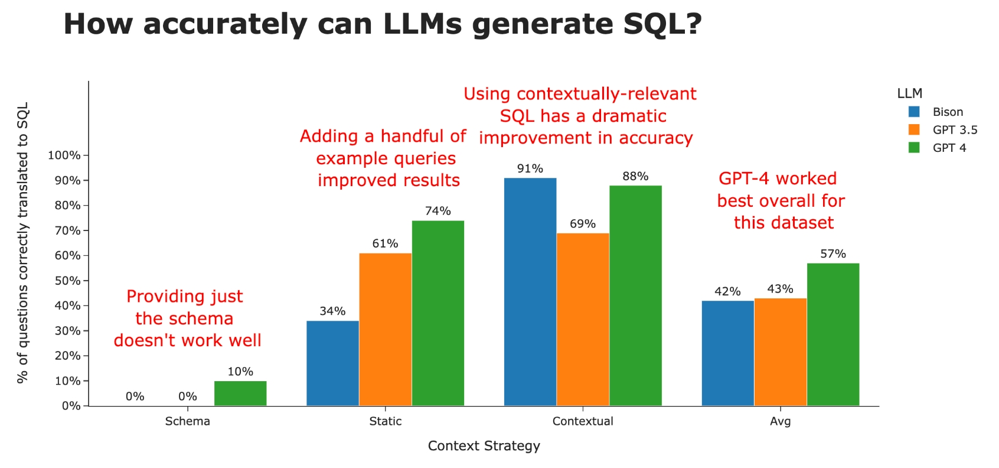
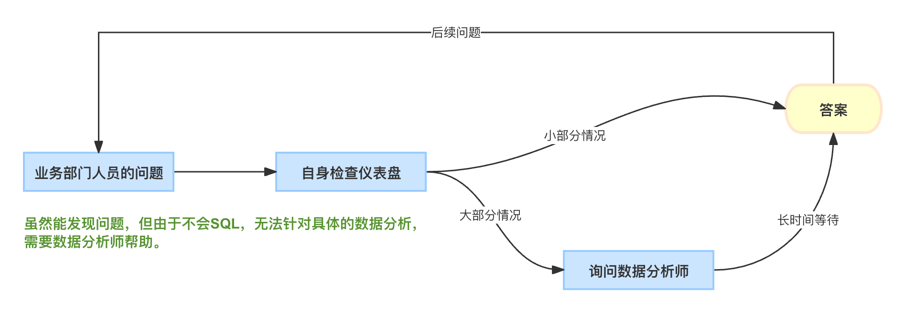
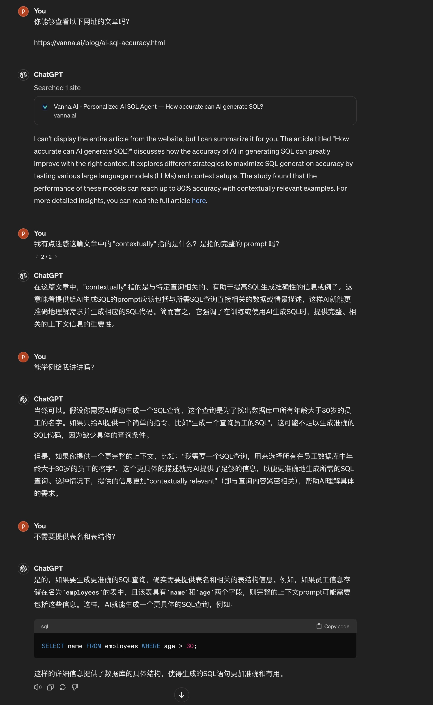
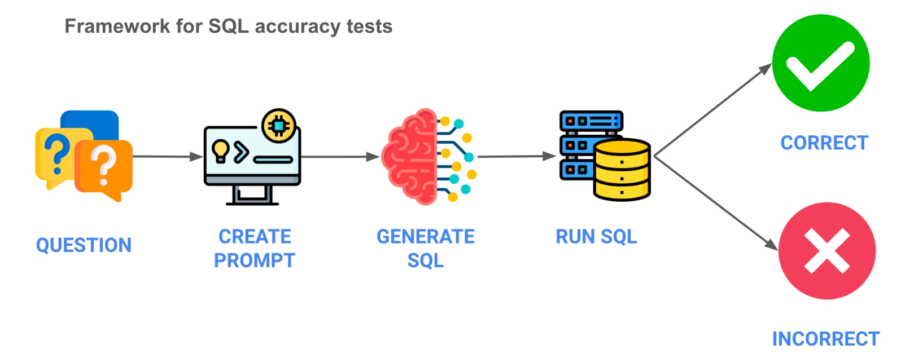
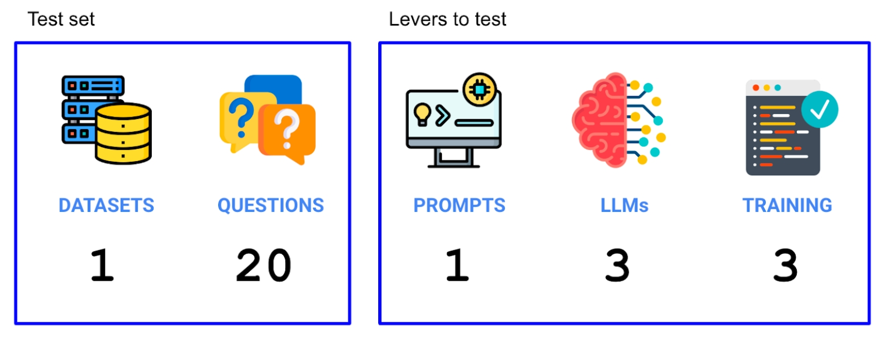
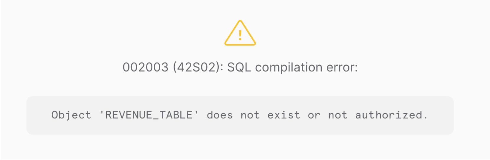
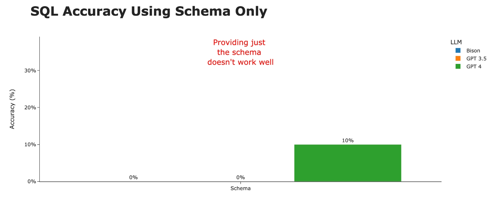

# How accurate can AI generate SQL? AI生成SQL有多准确？

Published 2023-08-17 发布于2023年8月17日<br>

🔥🔥🔥It turns out that it can do REALLY well if given the right context 如果提供了正确的上下文，结果会非常好<br>

AI SQL Accuracy: Testing different LLMs + context strategies to maximize SQL generation accuracy<br>

AI SQL准确性：测试不同的LLMs + 上下文策略以最大化SQL生成的准确性<br>
- [How accurate can AI generate SQL? AI生成SQL有多准确？](#how-accurate-can-ai-generate-sql-ai生成sql有多准确)
  - [TLDR 简而言之](#tldr-简而言之)
  - [Why use AI to generate SQL?](#why-use-ai-to-generate-sql)
  - [补充:providing contextually relevant correct SQL解释](#补充providing-contextually-relevant-correct-sql解释)
  - [Setting up architecture of the test(设置测试架构)](#setting-up-architecture-of-the-test设置测试架构)
    - [1. Question - We start with the business question.(我们从业务问题开始)](#1-question---we-start-with-the-business-question我们从业务问题开始)
    - [2. Prompt - We create the prompt to send to the LLM.(我们创建送入LLM的prompt)](#2-prompt---we-create-the-prompt-to-send-to-the-llm我们创建送入llm的prompt)
    - [3. Generate SQL - Using an API, we’ll send the prompt to the LLM and get back generated SQL.](#3-generate-sql---using-an-api-well-send-the-prompt-to-the-llm-and-get-back-generated-sql)
    - [4. Run SQL - We'll run the SQL against the database.](#4-run-sql---well-run-the-sql-against-the-database)
    - [5. Validate results - 验证结果](#5-validate-results---验证结果)
  - [Setting up the test levers(设置测试杠杆)](#setting-up-the-test-levers设置测试杠杆)
    - [Choosing a dataset(选择数据集)](#choosing-a-dataset选择数据集)
    - [Choosing the questions](#choosing-the-questions)
    - [Choosing the prompt(选择提示语)](#choosing-the-prompt选择提示语)
    - [Choosing the LLMs (Foundational models) - 选择LLMs（基础模型）](#choosing-the-llms-foundational-models---选择llms基础模型)
    - [Choosing the context(选择上下文)](#choosing-the-context选择上下文)
    - [静态SQL与动态SQL示例:](#静态sql与动态sql示例)
  - [Using ChatGPT to generate SQL(使用 ChatGPT 生成 SQL)](#using-chatgpt-to-generate-sql使用-chatgpt-生成-sql)
    - [Prompt:](#prompt)
    - [Response:](#response)
    - [Using schema only:](#using-schema-only)
    - [Using SQL examples(使用 SQL 示例)](#using-sql-examples使用-sql-示例)
  - [VANNA\_API\_KEY 用在哪里？](#vanna_api_key-用在哪里)

## TLDR 简而言之

The promise of having an autonomous(自主的) AI agent that can answer business users’ plain(普通的) English questions is an attractive but thus far elusive proposition.<br>

拥有一个能够回答商业用户普通英语问题的自主AI代理的承诺是一个吸引人但迄今为止难以实现的主张。<br>

Many have tried, with limited success, to get ChatGPT to write.<br>

许多人尝试过，但ChatGPT写作的成功率有限。<br>

The failure is primarily due of a lack of the LLM's knowledge of the particular dataset it’s being asked to query.<br>

失败主要是由于LLM对其被要求查询的特定数据集的知识不足所致。<br>

🔥In this paper, we show that **context is everything**, and with the right context, we can **get from ~3% accuracy to ~80% accuracy**.<br>

在本文中，我们表明上下文至关重要，并且通过正确的上下文，我们可以从大约3%的准确率提高到大约80%的准确率。<br>

We go through three different context strategies, and showcase one that is the clear winner - where we combine schema definitions, documentation, and prior SQL queries with a relevance search.<br>

我们介绍了三种不同的上下文策略，并展示了一个明显的优胜者 - 在这种策略中，我们将模式定义、文档和先前的SQL查询与相关性搜索相结合。<br>

> prior SQL queries 推测表示的是预先设置的SQL语句。

We also compare a few different LLMs - including Google Bison, GPT 3.5, GPT 4, and a brief attempt with Llama 2.<br>

我们还比较了几种不同的大型语言模型，包括Google Bison、GPT 3.5、GPT 4以及简短尝试了Llama 2。<br>

🔥While GPT 4 takes the crown of the best overall LLM for generating SQL, Google’s Bison is roughly equivalent when enough context is provided.<br>

🔥当提供足够的上下文时，尽管GPT 4在生成SQL方面被公认为最优秀的大型语言模型，Google的Bison也与之大致相当。<br>

Finally, we show how you can use the methods demonstrated here to generate SQL for your database.<br>

最后，我们将展示如何使用这里演示的方法为您的数据库生成SQL。<br>

Here's a summary of our key findings - 这里是我们关键发现的总结 -<br>




## Why use AI to generate SQL?

Many organizations have now adopted some sort of data warehouse or data lake - a repository of a lot of the organization’s critical data that is queryable for analytical purposes.<br>

许多组织现在已经采用了某种形式的数据仓库或数据湖——一个包含大量组织关键数据的存储库，可用于分析目的查询。<br>

This ocean of data is brimming with potential insights, but only a small fraction of people in an enterprise have the two skills required to harness the data —<br>

这海量的数据充满了潜在的洞察力，但企业中只有少数人具备利用这些数据所需的两项技能——<br>

1. A solid comprehension of advanced SQL, and / 对高级SQL有扎实的理解，并且

2. A comprehensive knowledge of the organization’s unique data structure & schema / 对组织独特的数据结构和模式有全面的了解

The number of people with both of the above is not only vanishingly small, but likely not the same people that have the majority of the questions.<br>

具备上述两种能力的人数不仅极少，而且很可能不是那些有大部分疑问的人。<br>

So what actually happens inside organizations? <br>

那么，组织内部实际上发生了什么？<br>

Business users, like product managers, sales managers, and executives, have data questions that will inform business decisions and strategy.<br>

业务用户，如产品经理、销售经理和高管，会有一些数据问题，这些问题将用于指导业务决策和战略。<br>

They’ll first check dashboards, but most questions are ad hoc and specific, and the answers aren’t available, so they’ll ask a data analyst or engineer - whomever possesses the combination of skills above.<br>

他们首先会查看仪表板，但大多数问题都是特定的临时问题，答案通常不可得，因此他们会向数据分析师或工程师提问——即任何拥有上述技能组合的人。<br>

These people are busy, and take a while to get to the request, and as soon as they get an answer, the business user has follow up questions.<br>

这些人很忙，处理这些请求需要一些时间，一旦他们得出答案，业务用户又有了后续问题。<br>

This process is painful for both the business user (long lead times to get answers) and the analyst (distracts from their main projects), and leads to many potential insights being lost.<br>

这个过程对业务用户（获取答案的时间过长）和分析师（分散了他们主要项目的注意力）都是痛苦的，而且会导致许多潜在的洞察丢失。<br>



Enter generative AI! LLMs potentially give the opportunity to business users to query the database in plain English (**with the LLMs doing the SQL translation**), and we have heard from dozens of companies that this would be a game changer for their data teams and even their businesses.<br>

键入生成式人工智能！大型语言模型可能为商业用户提供用简单英语查询数据库的机会（**由大型语言模型完成SQL翻译**），我们已经从数十家公司听说这将是其数据团队乃至整个业务的游戏规则改变者。<br>

The key challenge is generating accurate SQL for complex and messy databases.<br>

关键挑战是为复杂和混乱的数据库生成准确的SQL。<br>

🚨Plenty of people we’ve spoken with have tried to use ChatGPT to write SQL with limited success and a lot of pain.<br>

🚨我们与许多人交谈，他们尝试使用ChatGPT编写SQL，但成功有限，且过程痛苦。<br>

Many have given up and reverted back to the old fashioned way of manually writing SQL.<br>

许多人已放弃并回归到传统的手工编写SQL的方式。<br>

At best, ChatGPT is a sometimes useful co-pilot for analysts to get syntax right.<br>

在最好的情况下，ChatGPT有时可以作为分析师的有用副驾驶，帮助他们正确使用语法。<br>

But there’s hope! We’ve spent the last few months immersed in this problem, trying various models, techniques and approaches to improve the accuracy of SQL generated by LLMs.<br>

但有希望！我们在过去几个月中深入研究这个问题，尝试了多种模型、技术和方法来提高大型语言模型生成SQL的准确性。<br>

In this paper, we show the performance of various LLMs and how the strategy of providing contextually relevant correct SQL to the LLM can allow the LLM to achieve extremely high accuracy.<br>

在这篇论文中，我们展示了各种大型语言模型的表现，**以及如何通过提供与上下文相关的正确SQL给大型语言模型**，使其能够实现极高的准确度。<br>


## 补充:providing contextually relevant correct SQL解释



## Setting up architecture of the test(设置测试架构)

First, we needed to define the architecture of the test.<br>

首先，我们需要定义测试的架构。<br>

A rough outline is below, in a five step process, with pseudo code below -<br>

下面是一个粗略的概述，分为五个步骤，下面有伪代码 -<br>



### 1. Question - We start with the business question.(我们从业务问题开始)

```python
# 德国有多少客户？
question = "how many clients are there in germany"
```

### 2. Prompt - We create the prompt to send to the LLM.(我们创建送入LLM的prompt)

```python
prompt = f"""
Write a SQL statement for the following question:
{question}
"""
```

### 3. Generate SQL - Using an API, we’ll send the prompt to the LLM and get back generated SQL.

```python
sql = llm.api(api_key=api_key, prompt=prompt, parameters=parameters)
```

### 4. Run SQL - We'll run the SQL against the database.

```python
df = db.conn.execute(sql)
```

### 5. Validate results - 验证结果  

Finally, we’ll validate that the results are in line with what we expect.<br>

最后，我们将确认结果是否符合我们的预期。<br>

There are some shades of grey when it comes to the results so we did a manual evaluation of the results.<br>

结果存在一些灰色地带，因此我们进行了手动评估。<br>

You can see those results [here](https://github.com/vanna-ai/research/blob/main/data/sec_evaluation_data_tagged.csv) - 你可以在这里查看这些结果。<br>


## Setting up the test levers(设置测试杠杆)

Now that we have our experiment set up, we’ll need to figure out what levers would impact accuracy, and what our test set would be.<br>

现在我们已经建立了实验，我们需要确定哪些杠杆会影响准确性，以及我们的测试集会是什么。<br>

We tried two levers (the LLMs and the training data used), and we ran on 20 questions that made up our test set.<br>

我们尝试了两个杠杆（使用的大型语言模型和训练数据），并对构成我们测试集的20个问题进行了测试。<br>

So we ran a total of 3 LLMs x 3 context strategies x 20 questions = 180 individual trials in this experiment.<br>

因此，在这个实验中，我们总共进行了 3个大型语言模型 x 3种上下文策略 x 20个问题 = 180次单独的试验。<br>




### Choosing a dataset(选择数据集)

First, we need to choose an appropriate dataset to try.<br>

首先，我们需要选择一个合适的数据集来尝试。<br>

We had a few guiding principles -<br>

我们有一些指导原则 -<br>

- **Representative:** Datasets in enterprises are often complex and this complexity isn’t captured in many demo/sample datasets. We want to use a complicated database that has real-world use cases that contains real-world data.

具有代表性。企业中的数据集通常很复杂，这种复杂性在许多演示/样本数据集中无法捕捉。我们希望使用一个包含真实世界数据的复杂数据库，它有真实世界的使用案例。<br>

- **Accessible:** We also wanted that dataset to be publicly available.

可访问性。我们还希望这个数据集能够公开获取。<br>

- **Understandable:** The dataset should be somewhat understandable to a wide audience - anything too niche or technical would be difficult to decipher.

易于理解。这个数据集应该对广泛的受众有一定的可理解性——任何过于小众或技术性的内容都会难以解读。<br>

Maintained. We’d prefer a dataset that’s maintained and updated properly, in reflection of a real database.<br>

维护良好。我们更喜欢一个得到适当维护和更新的数据集，这反映了一个真实的数据库。<br>

✅A dataset that we found that met the criteria above was the Cybersyn SEC filings dataset, which is available for free on the Snowflake marketplace:<br>

✅我们找到的一个符合上述标准的数据集是 Cybersyn SEC filings 数据集，该数据集可以在 Snowflake 市场免费获取：<br>

```log
https://docs.cybersyn.com/our-data-products/economic-and-financial/sec-filings
```

### Choosing the questions

Next, we need to choose the questions. Here are some sample questions (see them all in this [file](https://github.com/vanna-ai/research/blob/main/data/questions_sec.csv)) -<br>

接下来，我们需要选择问题。这里有一些示例问题-<br>

1. How many companies are there in the dataset? - 数据集中有多少家公司？

2. What annual measures are available from the 'ALPHABET INC.' Income Statement? - 'ALPHABET INC.' 收益表中有哪些年度指标？

3. What are the quarterly 'Automotive sales' and 'Automotive leasing' for Tesla? - 特斯拉每季度的“汽车销售”和“汽车租赁”情况如何？

4. How many Chipotle restaurants are there currently? - 目前有多少家Chipotle餐厅？

Now that we have the dataset + questions, we’ll need to come up with the levers.<br>

现在我们已经有了数据集和问题，我们需要制定相应的策略。<br>

### Choosing the prompt(选择提示语)

For the **prompt**, for this run, we are going to hold the prompt constant, though we’ll do a follow up which varies the prompt.<br>

对于这次的 **提示语** ，我们将保持提示不变，尽管我们会进行后续的变动。<br>

### Choosing the LLMs (Foundational models) - 选择LLMs（基础模型）

For the LLMs to test, we’ll try the following - 对于要测试的LLMs，我们将尝试以下几种 -<br>

1. [Bison (Google)](https://cloud.google.com/vertex-ai/generative-ai/docs/learn/models?hl=zh-cn) - Bison is the version of [PaLM 2](https://blog.google/technology/ai/google-palm-2-ai-large-language-model/) that’s available via GCP APIs. - Bison（谷歌）- Bison是通过GCP API提供的PaLM 2版本。

2. [GPT 3.5 Turbo (OpenAI)](https://platform.openai.com/docs/models/gpt-3-5-turbo) - GPT 3.5 until recently was the flagship OpenAI model despite 4 being available because of latency and cost benefits, and not a huge accuracy difference (well - we’ll put that to the test) especially for basic tasks. - GPT 3.5 Turbo（OpenAI）- 直到最近，尽管GPT 4已经推出，但GPT 3.5仍是OpenAI的旗舰模型，这主要是因为其在延迟和成本上的优势，且在准确性上没有巨大差异（好吧，我们将对此进行测试），特别是对于基本任务。

3. [GPT 4 (OpenAI)](https://platform.openai.com/docs/models/gpt-4-and-gpt-4-turbo) - The more advanced but less performant OpenAI model. GPT 4 is multi-modal, though we won’t be using that functionality. - GPT 4（OpenAI）- 更高级但性能较低的OpenAI模型。GPT 4是多模态的，尽管我们不会使用这一功能。

4. [Llama 2 (Meta)](https://llama.meta.com/) - We really wanted to include an open source model - and the leading one is Meta’s Llama 2. But our setup through [Replicate](https://replicate.com/meta/llama-2-70b-chat) quickly conked out, and we weren’t able to fix it in time for publishing this. In our early runs, when it did work, we found performance to be mediocre at best. - Llama 2（Meta）- 我们真的想要包括一个开源模型 - 最主要的是Meta的Llama 2。但是我们通过Replicate的设置很快出现故障，我们无法及时修复以发布这个。在我们的早期运行中，当它工作时，我们发现其性能最多也只是一般。

### Choosing the context(选择上下文)

Finally, we’ll have three types of **context**. Context refers to what we send to the LLM that helps give the LLM context on our specific dataset.<br>

最后，我们将有三种类型的 **上下文** 。上下文指的是我们发送给LLM的内容，帮助LLM理解我们特定数据集的上下文。<br>

1. **Schema only:** We put the schema (using DDL) in the context window. - 仅限模式。我们在上下文窗口中放置模式（使用DDL）。<br>

> DDL是数据库领域中的一个缩写，代表“数据定义语言”（Data Definition Language）。例如 CREATE 、DROP 语句。

> SELECT 语句属于 SQL 中的 DML（数据操纵语言，Data Manipulation Language）部分，而不是 DDL（数据定义语言，Data Definition Language）。DML 主要用于数据的查询、插入、更新和删除操作。

🔥🔥🔥其实就是提供表结构，有了表结构才能生成正确的SQL语句。<br>

2. **Static examples:** We put static example SQL queries in the context windows. - 静态示例。我们在上下文窗口中放置静态示例SQL查询。

> 静态示例就是预设好的SQL语句。

3. **Contextually relevant examples:** Finally, we put the most relevant context (SQL / DDL / documentation) into the context window, finding it via a vector search based on embeddings. - 上下文相关示例。最后，我们将最相关的上下文（SQL / DDL / 文档）放入上下文窗口，通过基于嵌入的向量搜索找到它。

### 静态SQL与动态SQL示例:

假设你有一个电商网站的数据库，你想根据用户的选择动态地查询商品信息。<br>

**静态 SQL 示例**:<br>

```sql
SELECT * FROM products WHERE category = 'Books';
```

这个查询是静态的，因为它总是查询类别为 'Books' 的商品，不会根据用户的不同选择而改变。<br>

**动态 SQL 示例**:<br>

```sql
SELECT * FROM products WHERE category = ?;
```
在这个动态查询中，问号 `?` 是一个占位符，可以在执行查询时被实际的用户输入替换，如 'Electronics'、'Clothing' 等，这样查询就可以根据用户的选择来变化了。<br>

动态查询通常使用编程语言结合 SQL 实现，如在 Python、Java 等语言中，通过编程将用户的输入作为参数传递到查询中。这种方式让查询更加灵活和应对多变的需求。<br>


## Using ChatGPT to generate SQL(使用 ChatGPT 生成 SQL)

This section is a bit unfair to ChatGPT, but it’s a helpful place to get started.<br>

这一部分对 ChatGPT 来说有点不公平，但它是一个很好的起点。<br>

Let’s just take a question and ask ChatGPT to generate the SQL - 我们只需提出一个问题，让 ChatGPT 来生成 SQL -<br>

### Prompt:

```log
Write Snowflake SQL to answer the following question - 

What are the quarterly revenues by business segment for Alphabet?

Return SQL only
```

双语版:<br>

```log
Write Snowflake SQL to answer the following question -  

编写 Snowflake SQL 以回答以下问题 -

What are the quarterly revenues by business segment for Alphabet?  

Alphabet 的每个业务部门的季度收入是多少？

Return SQL only  

仅返回 SQL
```

### Response:

Certainly, here's the SQL query:<br>

```sql
SELECT
  EXTRACT(QUARTER FROM date_column) AS quarter,
  business_segment,
  SUM(revenue) AS quarterly_revenue
FROM
  revenue_table
WHERE
  company_name = 'Alphabet'
GROUP BY
  quarter,
  business_segment
ORDER BY
  quarter,
  business_segment;

-- Replace date_column, business_segment, revenue, revenue_table, and adjust any other identifiers to match your specific database schema.
-- 替换 date_column、business_segment、revenue、revenue_table，并调整任何其他标识符以匹配您的特定数据库架构。
```

Inevitably, when we try to run this, we hit an error, because it made up the table name since we didn't provide it -<br>

不可避免地，当我们尝试运行这段代码时，我们遇到了一个错误，因为它编造了表名，而我们并没有提供它 -<br>

> 数据库中没有名为 revenue_table 的表。



Of course, we are being unfair to the LLMs - as magical as they are, they cannot (unfortunately? luckily?) possibly know what’s in our database - yet.<br>

当然，我们对LLMs不公平 - 尽管它们非常神奇，但它们不可能（不幸地？幸运地？）知道我们数据库中的内容 - 至少目前是这样。<br>

So let’s hop into the tests where we give more context.<br>

所以，让我们进入那些我们提供更多上下文的测试中去。<br>

### Using schema only:

First, we take the schema of the dataset and put it into the context window.<br>

首先，我们获取数据表的模式并将其放入上下文窗口。<br>

This is usually what we've seen people do with ChatGPT or in tutorials.<br>

这通常是我们在使用ChatGPT或在教程中看到的操作方式。<br>

An example prompt may look like this (in reality we used the information schema because of how Snowflake shares work but this shows the principle) -<br>

示例提示可能如下所示（实际上我们使用了信息模式，因为这是Snowflake共享的工作方式，但这展示了原理）-<br>

```log
The user provides a question and you provide SQL. You will only respond with SQL code and not with any explanations.

Respond with only SQL code. Do not answer with any explanations -- just the code.

You may use the following DDL statements as a reference for what tables might be available.

CREATE TABLE Table1...

CREATE TABLE Table2...

CREATE TABLE Table3...
```

双语版:<br>

```log
The user provides a question and you provide SQL. You will only respond with SQL code and not with any explanations.  

用户提供一个问题，你提供SQL代码。你只需回答SQL代码，不需要提供任何解释。

Respond with only SQL code. Do not answer with any explanations -- just the code.  

仅以SQL代码回应。不要提供任何解释——只需代码。

You may use the following DDL statements as a reference for what tables might be available.  

你可以使用以下DDL语句作为可能可用的表的参考。

CREATE TABLE Table1...  

CREATE TABLE Table2...  

CREATE TABLE Table3...  
```

The results were, in a word, terrible.‼️<br>

结果可以用一个词来形容，那就是糟糕。‼️<br>

Of the 60 attempts (20 questions x 3 models), only two questions were answered correctly (both by GPT 4), for an abysmal accuracy rate of 3%.<br>

在60次尝试中（20个问题 x 3个模型），只有两个问题被正确回答（都是由GPT 4完成），准确率惨淡至3%。<br>

Here are the two questions that GPT 4 managed to get right -<br>

以下是GPT 4成功回答正确的两个问题 -<br>

What are the top 10 measure descriptions by frequency?<br>

频率最高的前10个度量描述是什么？<br>

What are the distinct statements in the report attributes?<br>

报告属性中的不同声明有哪些？<br>



It’s evident that by just using the schema, we don’t get close to meeting the bar of a helpful AI SQL agent, though it may be somewhat useful in being an analyst copilot.<br>

显然，仅仅使用模式，我们无法达到一个有用的AI SQL代理的标准，尽管它在作为分析师副驾驶方面可能有些用处。<br>

### Using SQL examples(使用 SQL 示例)

If we put ourselves in the shoes of a human who’s exposed to this dataset for the first time, in addition to the table definitions, they’d first look at the example queries to see how to query the database correctly.<br>

如果我们设身处地为第一次接触这个数据集的人考虑，除了表的定义，他们首先应了解怎样进行查询，以了解如何正确查询数据库。<br>

> 我们设身处地的把自己当作chatgpt。

These queries can give additional context not available in the schema - for example, which columns to use, how tables join together, and other intricacies of querying that particular dataset.<br>

这些查询可以提供表结构中无法获得的额外上下文 —— 例如，使用哪些列，表如何连接在一起，以及查询该特定数据集的其他复杂性。<br>

Cybersyn, as with other data providers on the Snowflake marketplace, provides a few (in this case 3) example queries in their documentation.<br>

与 Snowflake 市场上的其他数据提供商一样，Cybersyn 在其文档中提供了一些（在本例中为 3 个）示例查询。<br> 

Let’s include these in the context window.<br>

让我们将这些包含在上下文窗口中。<br>

By providing just those 3 example queries, we see substantial improvements to the correctness of the SQL generated.<br>

仅提供这 3 个示例查询，我们就看到了生成的 SQL 的正确性有了显著提高。<br>

However, this accuracy greatly varies by the underlying LLM.<br>

然而，这种准确性因底层 LLM 而异。<br>

It seems that GPT-4 is the most able to generalize the example queries in a way that generates the most accurate SQL.<br>

似乎 GPT-4 最能概括示例查询，从而生成最准确的 SQL。<br>


## VANNA_API_KEY 用在哪里？

Vanna.ai 使用 API 密钥主要是为了访问托管在 Vanna 服务器上的组件，比如语言模型（LLM）或向量存储。如果你已经有了自己的语言模型和向量存储，可以不使用 API 密钥来运行 Vanna。此外，如果你只是想快速开始而无需投入成本，Vanna 提供了免费的 API 密钥。<br>

总的来说，API 密钥需要的部分主要涉及到一些托管服务或特定功能，而 Vanna 的基础使用和许多功能仍然保持开源和免费。如果你想了解更多关于如何获取和使用 Vanna API 密钥的信息，可以查看官方文档提供的详细说明。<br>